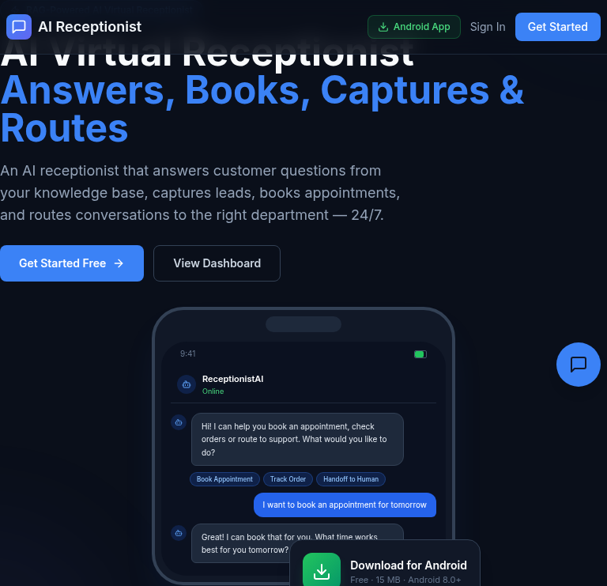

# AI Virtual Receptionist

An AI-powered virtual receptionist that **answers customer questions** (text *and voice*), **captures leads**, **books appointments**, and **routes conversations to the right department** — 24/7. Built as a multi-tenant full-stack web app with a native Android app and an embeddable widget.

**Live demo:** [chat.djaouad.tech](https://chat.djaouad.tech)



## Architecture

```
┌──────────────────────────────────────────────┐
│              Frontend (Next.js 14)             │
│   Landing │ Dashboard │ Inbox │ KB │ Leads     │
│   Appointments │ Analytics │ Settings          │
└──────────────────────┬───────────────────────┘
                       │ REST + WebSocket (Socket.io)
┌──────────────────────▼───────────────────────┐
│              Backend (NestJS)                  │
│   Auth │ Chat │ RAG (pgvector) │ Receptionist  │
│   Leads │ Appointments │ Routing │ WebSocket   │
└──────────────────────┬───────────────────────┘
                       │ SQL
┌──────────────────────▼───────────────────────┐
│       Postgres + pgvector (Neon/Supabase)      │
│  users │ companies │ conversations │ messages   │
│  knowledge_documents │ knowledge_chunks(1536d) │
│  leads │ appointments │ departments             │
└──────────────────────────────────────────────┘
```

## Features

- **RAG Knowledge Base** — upload docs, auto-chunk, embed into `pgvector`, retrieve with cosine similarity, answer with citations.
- **Voice AI Talk** — press-to-talk in the Inbox: the AI hears you, streams a spoken answer with live subtitles (Web Speech API — no external voice service needed).
- **AI Answers 24/7** — OpenRouter LLM with a receptionist system prompt.
- **Lead Capture** — the AI detects and saves visitor contact info (name, email, phone) into your pipeline.
- **Appointments** — visitors can book meetings in chat; the AI parses relative dates ("tomorrow at 14:00") and saves appointments.
- **Tool-Calling Agent** — the AI doesn't just talk: it invokes real functions (`capture_lead`, `book_appointment`, `send_confirmation_email`) to save leads, book appointments and send confirmation emails. Uses Gemini's free function-calling tier (auto-fallback from OpenRouter).
- **Department Routing** — intent classification routes each conversation to Sales / Support / Billing (configurable).
- **Real-Time Chat** — Socket.io messaging, typing indicators, human handoff & takeover.
- **Embeddable Widget** — lightweight vanilla-JS snippet for any website.
- **Analytics** — conversations, AI vs human ratio, leads, appointments.

## Tech Stack

| Component   | Technology                                        |
|-------------|---------------------------------------------------|
| Frontend    | Next.js 14, TailwindCSS, TypeScript, Socket.io-client |
| Backend     | NestJS, TypeScript, Socket.io                     |
| Database    | Postgres + pgvector (works with Neon & Supabase)  |
| LLM         | OpenRouter (`google/gemini-2.5-flash` default)    |
| Embeddings  | OpenAI `text-embedding-3-small` (with deterministic local fallback when no key) |

## Mobile App (Android)

Same full dashboard as a native app (Expo / React Native) — overview, live inbox, leads, appointments, analytics, knowledge base, team, guide and settings.

- **Download the Android APK** → [AI Virtual Receptionist — Android build](https://expo.dev/accounts/djaouadfrihs-team/projects/ai-virtual-receptionist/builds/334dda20-39ae-4e92-bc02-138df81f99eb) — scan the QR code (or open the link) on your phone to install directly.
- New APKs are auto-built on every push to `mobile/` (see the "Mobile App Build (EAS)" workflow in Actions).
- **iOS**: not yet published — iPhones require a paid Apple Developer account + TestFlight. Until then, run it on iOS via Expo Go (below).

Run from source:

```bash
cd mobile
npm install
npx expo start   # scan the QR with Expo Go, or press w for web
```

## Quick Start

### Prerequisites
- Node.js 18+
- A Postgres database with the `pgvector` extension (Neon or Supabase both support it)
- An OpenRouter API key

### 1. Backend

```bash
cd backend
cp .env.example .env
# Add DATABASE_URL, OPENROUTER_API_KEY (+ optional OPENAI_API_KEY)
npm install
npm run dev
```

The schema and seed data are applied automatically on startup (tables + pgvector index + demo content).

### 2. Frontend

```bash
cd frontend
cp .env.example .env  # NEXT_PUBLIC_API_URL=http://localhost:4000
npm install
npm run dev
```

### 3. Widget (optional)

```bash
cd widget
npm run build
```

- Frontend: http://localhost:3000
- Backend API: http://localhost:4000
- WebSocket: ws://localhost:4000

## Deployment

The backend is a long-running NestJS + Socket.io server, so it needs a container host (not a serverless platform). Recommended split:

| Piece   | Host | Notes |
|---------|------|-------|
| Frontend (Next.js) | **Vercel** | Auto-detected; set `NEXT_PUBLIC_API_URL` and `NEXT_PUBLIC_WS_URL` to your backend URL at build time |
| Backend (NestJS) | **Render / Railway / Fly.io** | Web service; enable WebSockets; set `DATABASE_URL`, `OPENROUTER_API_KEY`, `JWT_SECRET`, `JWT_REFRESH_SECRET` |
| Database | **Neon / Supabase** (external) | pgvector enabled |
| Widget | served from the backend | the backend serves `/widget.js` from `backend/public/` |

### Backend (Render example)
1. Create a **Web Service**, connect the repo.
2. Build command: `npm install && npm run build` (root directory set to `backend`)
3. Start command: `node dist/main` (set root directory to `backend`)
4. Env vars: `DATABASE_URL`, `OPENROUTER_API_KEY`, `JWT_SECRET`, `JWT_REFRESH_SECRET` (optional `OPENAI_API_KEY`, `OPENROUTER_MODEL`)
5. If the widget ever changes, rebuild it and refresh `backend/public/widget.js`:
   ```bash
   cd widget && npm run build && cp dist/widget.js ../backend/public/widget.js
   ```

### Frontend (Vercel)
1. Import the repo on Vercel (framework: Next.js, detected automatically).
2. Env vars at build time:
   - `NEXT_PUBLIC_API_URL=https://your-backend.onrender.com`
   - `NEXT_PUBLIC_WS_URL=https://your-backend.onrender.com`
   - `NEXT_PUBLIC_WIDGET_URL=https://your-backend.onrender.com`

## Usage

1. **Register a company** → you get an admin dashboard with seeded departments (Sales / Support / Billing).
2. **Add knowledge base docs** → content is chunked, embedded and stored in `pgvector`.
3. **Embed the widget** on a site (copy from Settings) or use the chat preview.
4. Visitors can ask questions (RAG answers), leave their email/phone (lead captured), or book a meeting (appointment saved).
5. **Inbox** → take over any conversation and chat with the visitor live, or use **AI Talk** (mic button) to speak to the AI out loud — it replies by voice with subtitles.
6. **Leads / Appointments** → manage everything the AI captured.

### Widget embed

```html
<script src="http://localhost:4000/widget.js"
  data-api-url="http://localhost:4000"
  data-ws-url="http://localhost:4000"
  data-company-id="YOUR_COMPANY_ID"
  data-title="Support">
</script>
```

## API Endpoints

| Method | Path | Description |
|--------|------|-------------|
| POST | `/auth/register` | Register company + admin (seeds default departments) |
| POST | `/auth/login` | Login, get tokens |
| POST | `/auth/refresh` | Refresh access token |
| GET | `/conversations` | List company conversations |
| POST | `/conversations` | Create conversation (public) |
| GET/POST | `/conversations/:id/messages` | Get / send messages |
| PATCH | `/conversations/:id/assign` `/resolve` | Assign agent / resolve |
| GET/POST | `/knowledge-base` | List / create docs (auto-chunk + embed) |
| DELETE/POST | `/knowledge-base/:id` `/reindex` | Delete / re-index doc |
| POST | `/knowledge-base/search` | Semantic KB search |
| POST | `/ai/query` | Receptionist response (structured intent/lead/appointment) |
| GET/POST | `/leads`, PATCH `/leads/:id/status` | Manage leads |
| GET/POST | `/appointments`, PATCH `/appointments/:id/status` | Manage appointments |
| GET/POST/PATCH/DELETE | `/departments` | Configure routing departments |
| GET | `/analytics/summary` | Dashboard metrics |

## WebSocket Events

| Event | Direction | Description |
|-------|-----------|-------------|
| `joinConversation` | Client → Server | Join a conversation room |
| `sendMessage` | Client → Server | Send a chat message (triggers AI) |
| `typing` | Bidirectional | Typing indicator |
| `newMessage` | Server → Client | New message received |
| `aiThinking` | Server → Client | AI is typing |
| `aiResponse` | Server → Client | AI reply + `intent`, `department`, `lead`, `appointment` |
| `takeover` | Server → Client | Agent took over from AI |

## Environment Variables

See `backend/.env.example` for the full list. Key ones:

| Variable | Required | Description |
|----------|----------|-------------|
| `DATABASE_URL` | Yes | Postgres + pgvector connection string |
| `OPENROUTER_API_KEY` | Yes | LLM provider |
| `OPENROUTER_MODEL` | No | Default `google/gemini-2.5-flash` |
| `GEMINI_API_KEY` | No | Gemini fallback — free-tier function calling for tools |
| `OPENAI_API_KEY` | No | Embeddings; falls back to local hashing if empty |
| `SMTP_HOST` / `SMTP_USER` / `SMTP_PASS` | No | Send confirmation emails; if empty, emails are logged instead |
| `JWT_SECRET` / `JWT_REFRESH_SECRET` | Yes | Auth secrets |

---

Built by [djaouad frih](https://djaouad.tech) — [djaouad.tech](https://djaouad.tech)
